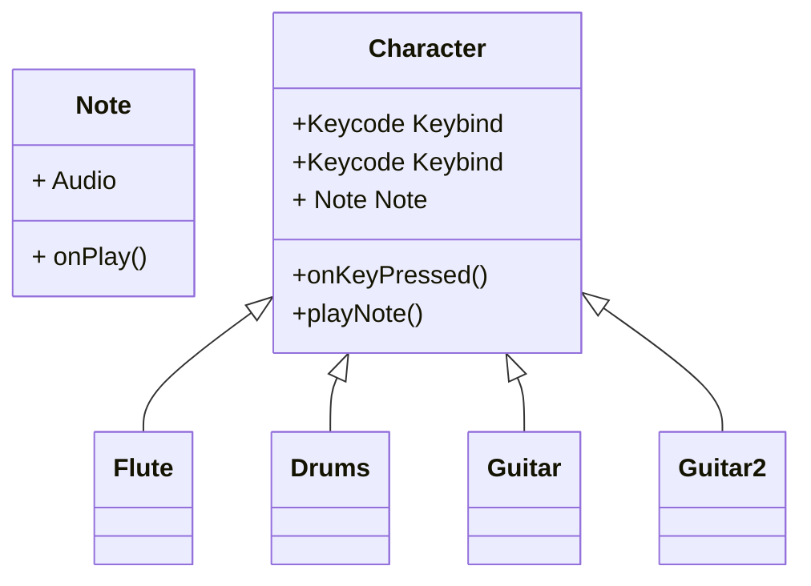

# Technical Details:

PERIOD 5
Wesley Leon and Bogdan Sotnikov
Team name: "Team Name"

     
# Project Design

UML Diagrams and descriptions of key algorithms, classes, and how things fit together.

Four characters at center

Class for notes - method to play the note when hit
Class for attacks - Projectiles - contain XY info

Attacks play notes when attack.pos lies within note.hit

Character instantiate - assigns 2 attacks as variables - assigns them to keybinds
WASD and ARROWS
Add additional UI toggle for traditional asdf hjkl binding

Game loop - 
UI menu with song options -> screen wipe based transition
Save selected song into UserAgent singleton
start game loop - start song play
Count score per note
on finish -> detail prompt - > screen wipe transition 
End loop -

will need algo to convert song into notes -> python -> normalize sound -> regression

    
# Intended pacing:

How you are breaking down the project and who is responsible for which parts.

Wesley - UX, Gamerules, Song Note conversion, Art, Game Loop
Bogdan - UI, Art, Music, Game Loop

